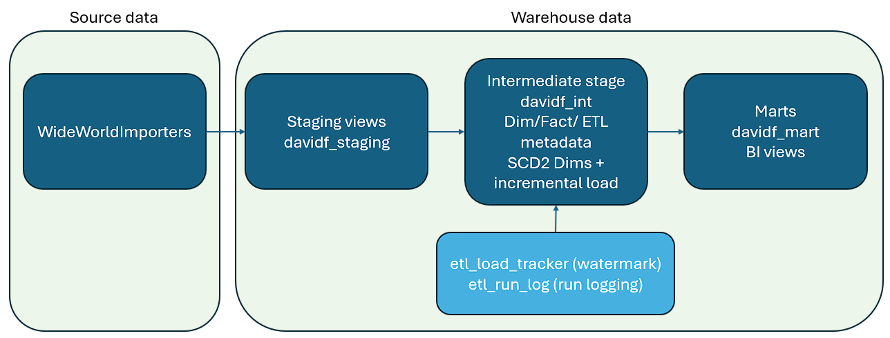
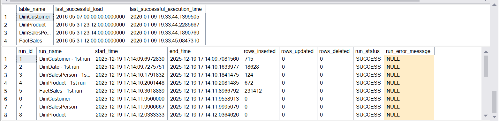
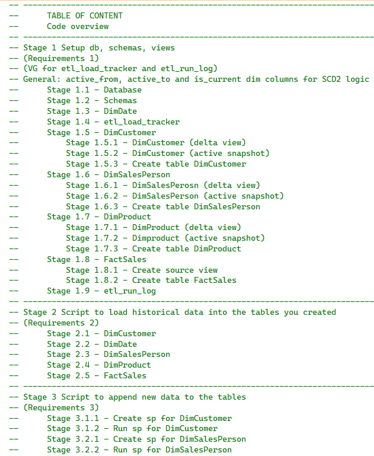
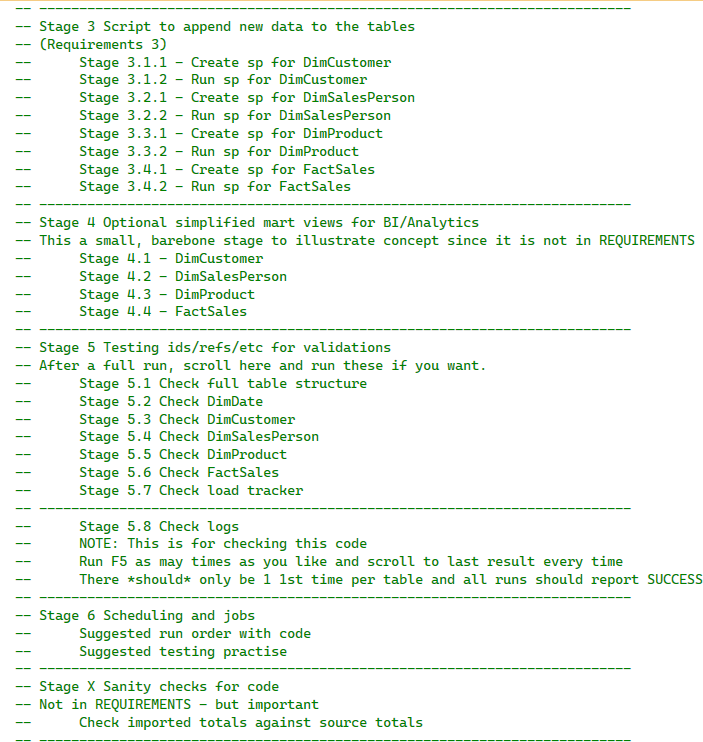

# SQL Server ETL Mini Data Warehouse (WideWorldImporters → DW)
A single-file T-SQL ETL project demonstrating **incremental loads**, **SCD2-style dimensions**, and **ETL observability (tracking + run logs)**.

> Companion “why this matters” project (Power BI + analysis):
https://github.com/DavidFarm/temporal-credit-analysis

---
## TL;DR
A SQL Server ETL mini-DW (WideWorldImporters → DW) showing **incremental loads + SCD2 dims + run logging**.  
Start with the **Code tour** section, then open the SQL file [`code/SQL_1_Assignment_2_David_Färm.sql`](code/SQL_1_Assignment_2_David_Färm.sql).

---

## Why this repo exists
This repo is the **implementation** behind a classic analytics workflow:
1) ingest/source views  
2) build a DW core (dims + facts)  
3) publish BI-friendly mart views  
4) run repeatedly with logging + watermarks

It’s written as a structured, staged script (≈1800 lines) intended to be easy to review.

---

## What this demonstrates (portfolio highlights)
- **Incremental loads** using a watermark pattern (`etl_load_tracker`)
- **SCD2-style dimensions** with `active_from`, `active_to`, `is_current`
- **Run logging + error handling** (`etl_run_log`, TRY/CATCH, transactions)
- **Star schema**: DimCustomer / DimProduct / DimSalesPerson / DimDate → FactSales
- **Validation & sanity checks** after execution

---

## Architecture


---

## Execution logs (proof it runs)


---

## Code structure (stages / how to navigate)
The script is organized into numbered stages.

**Some highlights if you only have 5 minutes:**
1. **Stage 1.4 / 1.9** – ETL metadata: `etl_load_tracker` + `etl_run_log`
(setting up watermarks logs for incremental runs and logging each runs & actions taken)
2. **Stage 3** – incremental ETL stored procedures (`etl_load_dim*`, `etl_load_factsales`)
(main structure of loading, validating, mapping and organizing data)
3. **Stage 5 / Stage X** – validations + sanity checks
(Extra soft checks based on ETL/DW logic)

### Stages 1–3


### Stages 3–X


---

## How to run (10 minutes)
### Prerequisites
- SQL Server
- WideWorldImporters sample database installed on the same instance

### Run
1. Open and execute:
   - `code/SQL_1_Assignment_2_David_Färm.sql`
2. Re-run the ETL procedures to validate incremental behavior. (Run once to create DB/objects and do the inital load logic; re-run procs to confirm incremental = 0 rows)
3. Inspect logs to validate results from each run are as expected:
   - `davidf_int.etl_run_log`
   - `davidf_int.etl_load_tracker`

---

## Key components (incl link to full code)
- **SQL script:** [`code/SQL_1_Assignment_2_David_Färm.sql`](code/SQL_1_Assignment_2_David_Färm.sql)
- **ETL procedures:** `etl_load_dimcustomer`, `etl_load_dimsalesperson`, `etl_load_dimproduct`, `etl_load_factsales`
- **Metadata tables:** `davidf_int.etl_load_tracker`, `davidf_int.etl_run_log`
- **Schemas:** `davidf_staging`, `davidf_int`, `davidf_mart`


---

## Selected code excerpts (what to look for)

### 1) Incremental extraction via watermark (staging “delta” view)
**Why it matters:** proves the pipeline is designed to run repeatedly and only process changes (not full reloads).

```sql
create or alter view davidf_staging.src_customer as
	with et as (
		select last_successful_load as ts
		from davidf_int.etl_load_tracker
		where table_name = 'DimCustomer'
	)
	select ...
	from WideWorldImporters.Sales.Customers c
	cross join et
	where
		c.ValidFrom > et.ts OR
		(c.ValidTo > et.ts AND c.ValidTo < cast('9999-12-31' as datetime2))

	union all

	select ...
	from WideWorldImporters.Sales.Customers_Archive c
	-- (same watermark filter for historical rows)

-- "close out" current row when attributes changed
update
	dest
set
	dest.is_current = 0,
	dest.active_to = src.customer_valid_from
from
	davidf_int.DimCustomer dest
	join davidf_staging.src_customer src
		on dest.customer_nk = src.customer_id
		and dest.is_current = 1
where
	ISNULL(src.customer_name, '') <> ISNULL(dest.customer_name, '') OR
	ISNULL(src.customer_category_name, '') <> ISNULL(dest.customer_category_name, '') OR
	ISNULL(src.customer_main_sellerid, '') <> ISNULL(dest.customer_main_sellerid, '');

-- insert new versions (and brand-new customers)
insert into davidf_int.DimCustomer (customer_nk, customer_name, customer_main_sellerid,
	customer_category_name, is_current, active_from, active_to)
select src.customer_id, src.customer_name, ISNULL(src.customer_main_sellerid, -1),
	src.customer_category_name, src.customer_is_current, src.customer_valid_from, src.customer_valid_to
from davidf_staging.src_customer src
left join davidf_int.DimCustomer dest
	on src.customer_id = dest.customer_nk and dest.is_current = 1
where dest.customer_nk IS NULL
	and not exists (
		select 1 from davidf_int.DimCustomer c
		where c.customer_nk = src.customer_id
		  and c.active_from = src.customer_valid_from
		  and c.active_to   = src.customer_valid_to
	);
```
### 2) SCD2-style dimension handling (close old + insert new version)
```sql
-- "close out" current row when attributes changed
update
	dest
set
	dest.is_current = 0,
	dest.active_to = src.customer_valid_from
from
	davidf_int.DimCustomer dest
	join davidf_staging.src_customer src
		on dest.customer_nk = src.customer_id
		and dest.is_current = 1
where
	ISNULL(src.customer_name, '') <> ISNULL(dest.customer_name, '') OR
	ISNULL(src.customer_category_name, '') <> ISNULL(dest.customer_category_name, '') OR
	ISNULL(src.customer_main_sellerid, '') <> ISNULL(dest.customer_main_sellerid, '');

-- insert new versions (and brand-new customers)
insert into davidf_int.DimCustomer (customer_nk, customer_name, customer_main_sellerid,
	customer_category_name, is_current, active_from, active_to)
select src.customer_id, src.customer_name, ISNULL(src.customer_main_sellerid, -1),
	src.customer_category_name, src.customer_is_current, src.customer_valid_from, src.customer_valid_to
from davidf_staging.src_customer src
left join davidf_int.DimCustomer dest
	on src.customer_id = dest.customer_nk and dest.is_current = 1
where dest.customer_nk IS NULL
	and not exists (
		select 1 from davidf_int.DimCustomer c
		where c.customer_nk = src.customer_id
		  and c.active_from = src.customer_valid_from
		  and c.active_to   = src.customer_valid_to
	);
```
### 3) Fact load joins the correct historical dimension version (+ unknown fallback)
```sql
select
	s.order_nk,
	ISNULL(c.customer_id, unknowns.unknown_customer)        as sales_customerid,
	ISNULL(sp.salesperson_id, unknowns.unknown_salesperson) as sales_salespersonid,
	ISNULL(p.product_id, unknowns.unknown_product)          as sales_productid,
	d.date_key,
	s.orderitem_quantity, s.orderitem_unitprice, s.orderitem_taxrate,
	s.orderitem_value_pretax, s.orderitem_value_posttax,
	SYSUTCDATETIME(), s.order_lasteditwhen
from davidf_staging.src_sales s
left join davidf_int.DimCustomer c
	on s.order_customerid = c.customer_nk
	and s.order_lasteditwhen >= c.active_from and s.order_lasteditwhen < c.active_to
left join davidf_int.DimSalesPerson sp
	on s.order_salespersonid = sp.salesperson_nk
	and s.order_lasteditwhen >= sp.active_from and s.order_lasteditwhen < sp.active_to
left join davidf_int.DimProduct p
	on s.orderitem_productid = p.product_skunumber_nk
	and s.order_lasteditwhen >= p.active_from and s.order_lasteditwhen < p.active_to
join davidf_int.DimDate d on s.order_date = d.date_value
left join davidf_int.FactSales fs on s.order_nk = fs.sales_nk
-- unknown members (NK = -1) keep fact loads resilient
cross join (
	select
		(select customer_id from davidf_int.DimCustomer where customer_nk = -1 and is_current = 1) as unknown_customer,
		(select salesperson_id from davidf_int.DimSalesPerson where salesperson_nk = -1 and is_current = 1) as unknown_salesperson,
		(select product_id from davidf_int.DimProduct where product_skunumber_nk = -1 and is_current = 1) as unknown_product
) unknowns
where fs.sales_nk IS NULL;
```
---

## License
This project is licensed under the MIT License — see the [text](docs/license.md)(`LICENSE`) file for details.

---

## About me
I'm David Farm — Stockholm-based and transitioning into Data Engineering, with a background in project leadership and data-driven decision support in finance and real estate development.

**What I bring:**
- SQL Server / T-SQL (ETL patterns, incremental loads, SCD2-style dimensions)
- BI & analytics (Power BI, reporting, stakeholder-facing delivery)
- Project execution (building reliable pipelines, structure, documentation)

**What I'm looking for:**
Data Engineering / Analytics Engineering / BI Engineering roles (Stockholm, Sweden — open to relocation for the right role).

**Links:**
- LinkedIn: www.linkedin.com/in/david-färm-a16022294

## Contact
Best way to reach me: LinkedIn (DM).
